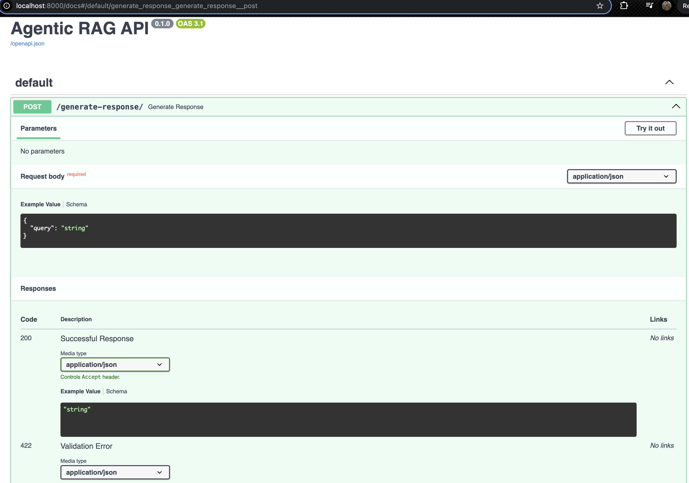
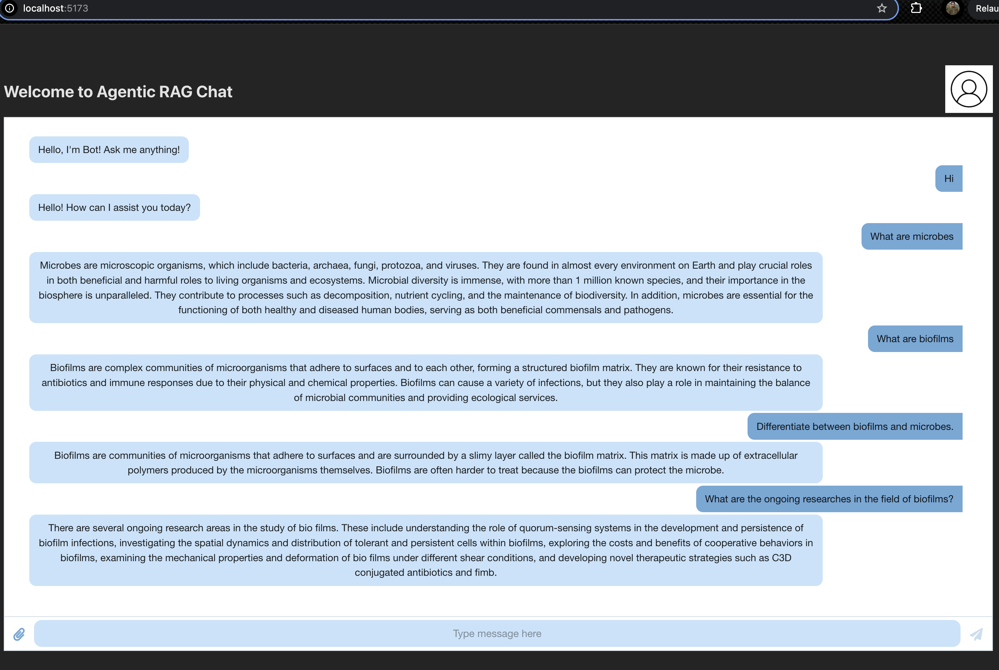

# 🧠 Modular RAG System

A scalable, agent-driven Retrieval-Augmented Generation (RAG) system designed to process documents, embed semantic information, and answer user queries using autonomous agents. Built with a clean architecture that separates responsibilities into agents and services, the system is easy to extend, test, and deploy.

---

## 📁 Project Structure
```
├── main.py ← Project entry point (API runner)
├── src/
│ ├── api.py ← FastAPI interface for query & indexing
│ ├── config.py ← Configuration and environment handling
│ ├── logger.py ← Logger setup
│ ├── agents/
│ │ ├── init.py
│ │ ├── chunker.py ← Splits documents into text chunks
│ │ ├── embedder.py ← Embeds chunks using transformer models
│ │ ├── planner.py ← Directs agent flow based on query
│ │ ├── reasoner.py ← Refines and expands query context
│ │ └── executor.py ← Generates final response from retrieved content
│ └── services/
│ ├── init.py
│ ├── docs_loader.py ← Loads and parses documents (PDFs, etc.)
│ ├── sectioner.py ← Organizes documents into labeled sections
│ ├── indexer.py ← Vector index management
│ ├── retriever.py ← Embedding-based retrieval (Top-k search)
│ └── delete_index.py ← Deletes stored vector indexes
├── client/ ← (Optional) Frontend or CLI interface
├── documents/ ← Raw input documents for ingestion
├── tests/
│ ├── conftest.py ← Fixtures and test setup
│ ├── test_agents.py ← Unit tests for agent modules
│ └── test_services.py ← Unit tests for service modules
├── .env_SAMPLE ← Environment variables for secrets & config
├── requirements.txt ← Project dependencies
├── .gitignore ← Files/folders to exclude from Git
└── README.md ← You are here
```
---

## 🚀 Features

- ✅ Agent-based modular RAG pipeline
- ✅ Embedding generation from document chunks
- ✅ Efficient document retrieval using vector search
- ✅ API-driven access using FastAPI
- ✅ Unit testing suite for core logic
- ✅ Easily extendable for custom use-cases

---

## 🛠️ Setup Instructions
### Software Requirements

```sh
Python v3.12.9 (*)
Elasticsearch v8.12.1 (*)
```

### 1. Clone & Create Environment
```bash
git clone https://github.com/AashishGh/Agentic_RAG_System.git
cd Agentic_RAG_System
python -m venv env
source env/bin/activate   # Windows: venv\Scripts\activate
pip install -r requirements.txt
```

###  2. Configure Environment

Create a `.env` file in the root directory with the exact same content as [.env_SAMPLE](.env_SAMPLE) file:

Update username and password based on your elasticsearch server.

---
## ⚡ GPU Requirements

The Agentic RAG system uses the [`deepseek-ai/DeepSeek-R1-Distill-Llama-8B`](https://huggingface.co/deepseek-ai/DeepSeek-R1-Distill-Llama-8B) model for language generation. This model is highly optimized and distilled, but still requires considerable hardware resources.

### Minimum GPU Requirements

| Requirement        | Recommended Specs                         |
|--------------------|-------------------------------------------|
| GPU Model          | NVIDIA A100 / A40 / RTX 4090 / 3090       |
| GPU Memory         | **≥ 16 GB VRAM**                          |
| Precision Support  | bfloat16 or float16 (for quantized loads) |
| CUDA Version       | CUDA 11.7+ or 12.x                        |
| Drivers            | NVIDIA Driver 510+                        |

###  Notes

- For best performance, load the model in `bfloat16` or `float16` precision with `device_map='auto'`.
- Multi-GPU setups using `accelerate` or `deepspeed` are supported if memory is insufficient.
- For CPU-only inference (not recommended), use `bitsandbytes` 4-bit quantization — **very slow**.
- If you are using HuggingFace Transformers, ensure you have `transformers`, `accelerate`, and `flash-attn` installed.

## 📄 Document Format Requirements

Before using the RAG system, all documents must be converted to `.txt` format. The system expects raw text input for chunking and embedding. If you have `.pdf` documents, place all of them in separate folder named <your_domain_name> inside documents/. You can have multiple domain folders inside documents/ <br>
Use the included `text_extracter.py` script to convert all your PDFs in bulk.

```python
python text_extracter.py
```

## ⚙️ How It Works

 **Ingestion**  
`docs_loader.py` loads documents from the `/documents` directory.

 **Chunking**  
`chunker.py` divides large documents into overlapping text windows for context preservation.

 **Embedding**  
`embedder.py` converts text chunks into high-dimensional vectors using a transformer-based model.

 **Indexing**  
`indexer.py` stores these embeddings into a vector database for efficient retrieval.

 **Retrieval**  
`retriever.py` fetches top-k relevant chunks from the index based on semantic similarity to the query.

 **Reasoning & Execution**  
`planner.py`, `reasoner.py`, and `executor.py` collaborate to refine the query and generate accurate, context-rich responses.

 **Serving**  
`api.py` exposes endpoints using FastAPI for document upload and intelligent querying.


## 🖥️ Running the Agentic RAG System
To fully run the system, follow these steps in order:
### 1. Start Elasticsearch
Ensure Elasticsearch is running on your machine before launching the backend. Follow [Elasticsearch installation docs](https://www.elastic.co/guide/en/elasticsearch/reference/current/starting-elasticsearch.html) to run it locally. <br>
PS: System assumes elastic server to be run at port 9200.

Verify it is running:
```bash
curl http://localhost:9200
```
### FOR FIRST TIME SETUP or when new documents are to be added in the database: 
Index the elastic search with the documents formatted previously as per requirements. To do so:
-  Delete the indices if exist and Index the documents:
```bash
cd src/services/
python delete_index.py
python indexer.py
```

### 2. Launch the FastAPI Backend
Start the FastAPI server from the root directory:
```bash
python main.py
```
By default, the server runs at:
http://127.0.0.1:8000 <br>
You can access: <br>
Swagger UI: http://127.0.0.1:8000/docs <br>
ReDoc: http://127.0.0.1:8000/redoc

### 3. Launch the React Frontend (Client)
You can access the client side application made with React JS by accessing `./client` folder and by running the application.
Also, you can find the [Readme.md for React Application](./client/README.md) which guides you through the process to install application locally.

## 🧪 Run Tests

To execute all tests:

```bash
pytest tests/
```
This will run unit tests for both:
agents/ (e.g., chunker, embedder, executor),and 
services/ (e.g., docs_loader, retriever, indexer).

Make sure all dependencies are installed and your environment is properly configured before running tests.

## 👥 Contributing
Feel free to **fork** the repository, **clone** it locally, and open a **pull request** with your changes.

Please ensure your changes are well-tested and documented.

---

## 📄 License

This project is licensed under the **MIT License**.  
See the [LICENSE](./LICENSE) file for details.

---


